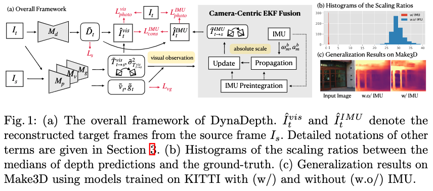
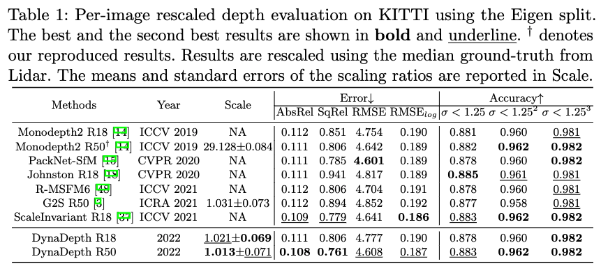
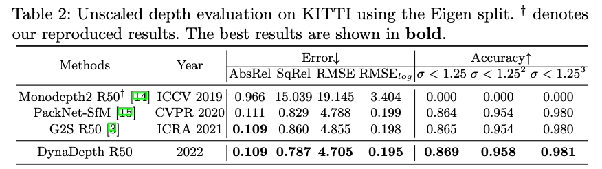
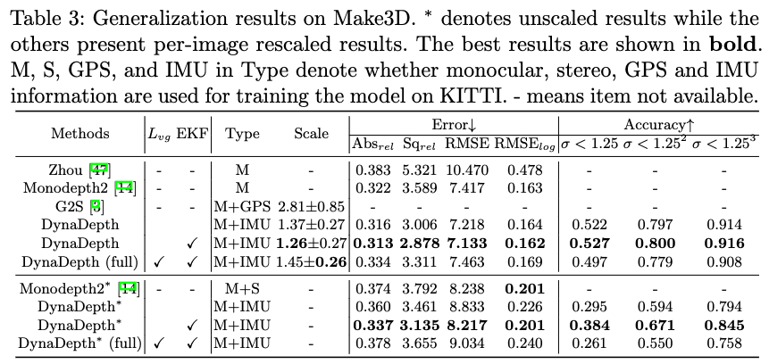

# DynaDepth

This is the official PyTorch implementation for **[Towards Scale-Aware, Robust, and Generalizable Unsupervised Monocular Depth Estimation by Integrating IMU Motion Dynamics], ECCV2022**

If you find this work useful in your research please consider citing our paper:
```
@inproceedings{zhang2022towards,
  title={Towards Scale-Aware, Robust, and Generalizable Unsupervised Monocular Depth Estimation by Integrating IMU Motion Dynamics},
  author={Zhang, Sen and Zhang, Jing and Tao, Dacheng},
  journal={ECCV},
  year={2022}
}

```

## Method Overview


## Results on KITTI



## Generalization on Make3D


## Training

This codebase is developed under PyTorch-1.4.0, CUDA-10.0, and Ubuntu-18.04.1. You can train our full model with:

```shell
python train.py --data_path YOUR_PATH_TO_DATA --use_ekf --num_layers 50
```

To use ResNet-18 rather than ResNet-50 as the backbone, you can change ```--num_layer``` to ```18```

To disable the ekf fusion and use the IMU-related losses only, you can simply remove ```--use_ekf```

To use loss weights other than the default setting, you can manipulate with the options, e.g.,
* ```--imu_warp_weight 0.5 --imu_consistency_weight 0.01```
* ```--velo_weight 0.001 --gravity_weight 0.001```

## Evaluation 

You can evaluate on the KITTI test set with:

```shell
python evaluate_depth.py --num_layer 50 --load_weights_folder YOUR_PATH_TO_MODEL_WEIGHTS --post_process
```

By default, we report the learnt scale without the median scaling trick. Use ```--eval_mono``` if you want to test the performance with edian scaling

For evaluation without post processing, simply remove ```--post_process```. 

To evaluate the models with ResNet-18 backbone, change ```--num_layer``` to ```18```ccordingly.

To evaluate the models on Make3D, use ```evaluate_make3d.py``` with the same arguments as ```evaluate_depth.py```. But you need to change the variable ```main_path``` in ```read_make3d()``` to your own path that contains test images of Make3D.


## Acknowledgment
This repo is built upon the excellent works of [monodepth2](https://github.com/nianticlabs/monodepth2), [deep_ekf_vio](https://https://github.com/lichunshang/deep_ekf_vio), and [liegroups](https://github.com/utiasSTARS/liegroups). The borrowed codes are licensed under their original license respectively.
